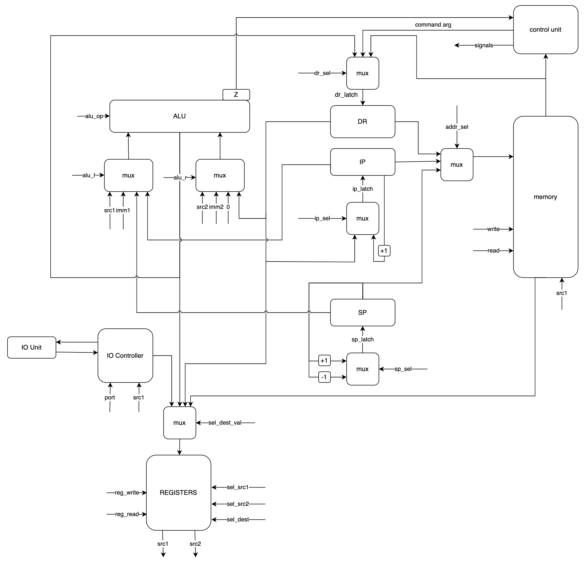

# Отчёт по лабораторной работе № 3

Выполнил Аскаров Эмиль Рамилевич P3210

Вариант
```lisp | risc | neum | hw | instr | binary | stream | port | pstr | prob1 | cache```

Базовый

## Язык программирования

Язык lisp-подобный.

Любое выражение в скобках (s-expression) возвращает значение.
Поддерживаются числовые и строковые литералы.
Типизация динамическая, поддерживаются два типа: целые числа и строки. Причем
функции `read_char`, `print_char` работают именно с целыми числами.
Для `while` и `if` можно использовать целые числа, где `0` - это `false`, а любое другое число - `true`.

```bnf
program = s_expression

s_expression = "(" symbol ")" | expression | "("s_expression")"
   
symbol = identifier | string_literal | number

expression = defun_expr 
    | if_expr 
    | while_expr 
    | setq_exp
    | print_char_exp
    | print_string_exp
    | user_defined_function_call_exp
    | progn_exp
    | import_expr
    
defun_expr = "(" "defun" identifier "(" identifiers ")" s_expression ")"

import_expr = "(" "import" [path-to-file] ")"

identifiers = identifier | identifier identifiers

if_expr = "(" "if" s_expression s_expression s_expression ")"

while_expr = "(" "while" s_expression s_expression ")"

setq_exp = "(" "setq" identifier s_expression ")"

print_char_exp = "(" "print_char" s_expression ")"

print_string_exp = "(" "print_string" s_expression ")"

user_defined_function_call_exp = "(" identifier s_expressions ")"

progn_exp = "(" "progn" s_expressions ")"

s_expressions = s_expression | s_expression s_expressions

identifier = idenitfier_symbol | identifier_symbol identifier

idenitfier_symbol = letter | "_"

string_literal = "\"" [char sequence] "\""
```

* `defun` - определение функции, возвращает 0. Рекурсивные функции не поддерживаются, так как не требовались.
* `if` - условный оператор, возвращает значение второго выражения, если первое не равно 0, иначе третье.
  Обязательно должно быть три выражения - условие, ветка иначе, ветка истины.
* `while` - цикл с предусловием, возвращает результат последнего выражения в теле цикла в последней итерации.
* `setq` - присваивание, возвращает значение присвоенной переменной.
* `print_char` - выводит символ с кодом, равным значению выражения, возвращает код символа.
* `print_string` - выводит строку, равную значению выражения, возвращает выведенную строку.
* `progn` - последовательное выполнение выражений, возвращает результат последнего выражения.
* вызов функции - возвращает результат функции (последнего выражения в теле функции).
* литералы - возвращают сами себя.
* идентификаторы - возвращают значение переменной, к которой они привязаны.
  Использование идентификатора функции без ее вызова недопустимо.

## Организация памяти

Фон Неймановская архитектура.

Память представляет из себя четыре секции:

```text
    +-----------------+
    |   JMP_TO_CODE   |
    +-----------------+
    |   STATIC_DATA   |
    |                 |
    |                 |
    |                 |
    +-----------------+
    |      CODE       |
    |                 |
    |                 |
    |                 |
    +-----------------+
    |      STACK      |
    |                 |
    |                 |
    +-----------------+
```

* `JMP_TO_CODE` - одиночная инструкция, которая является адресной командой
  JMP, которая переходит на начало секции `CODE

* `STATIC_DATA` - секция, в которой хранятся строки, а именно строковые литералы и строки, введенные пользователем.
  Строки расположены в том порядке, в котором они встречаются в AST программы

* `CODE` - секция, в которой хранятся инструкции

* `STACK` - секция динамической памяти адресуемая специальным регистром (SP - stack pointer)

После вычисления любого выражения, его результат кладется в один из регистров общего назначения.
При вычислении выражения с бинарным оператором, второй операнд вычисляется, кладется на стек,
после чего вычисляется первый, далее второй операнд загружается в свободный регистр и
проводится операция над двумя регистрами.

Функции хранятся в секции `CODE` в виде списка инструкций, которые выполняются последовательно. Перед
телом функции идет инструкция `JMP`, которая позоляет перепрыгнуть через ее тело.

Все переменные аллоцируются на стеке. Если при этом переменная была объявлена внутри функции,
область ее видимости ограничивается телом функции.

Числовые литералы загружаются с помощью непосредственной адресации. Значение литерала должно умещаться в 21 бит.

Процессор имеет 2 регистра общего назначения

## Система команд

* Машинное слово - 32 бита
* Количество регистров общего назначения - 2
* Ввод-вывод осуществляется как поток токенов, port-mapped
* Поток управления:
    * Поддерживаются условные и безусловные переходы
    * В случае, если инструкция не касается переходов, то после нее инкрементится IP (Instruction Pointer)

Поддерживаются 4 вида адресации:

* Непосредственная
* Относительно стека
* Косвенная относительная
* Абсолютная
* Регистровая

Также команда может быть безадресной

На выполнение каждой инструкции есть 4 цикла:

1. Цикл выборки инструкции. (2 такта)
2. Цикл выборки адреса (для адресации относительно стека и косвенной) (1 такт)
3. Цикл выборки операнда (для всех видов адресации, кроме непосредственной) (1 такт)
4. Цикл исполнения

### Набор инструкций


## Транслятор

Транслятор состоит из двух частей:

* Лексер, реализован в [tokenizer](./computer_simulator/translator/tokenizer.py)
* Модуль, преобразующий токены в программу, реализован
  в [expression_translator](./computer_simulator/translator/expression_translator.py)

Также транслятор поддерживает базовый препроцессинг (поддерживается директива `import`, которая инлайнит весь код по
указанному файлу на место самого выражения, содержащего директиву). Это позволяет, например, выделить
функцию `print_int` в отдельную библиотеку [здесь](util/io.lisp)

На вход принимает два файла:

* Файл с программой на языке высокого уровня
* Путь к файлу, в который будет записана программа в машинных словах (бинарный формат)

## Модель процессора

Модель процессора реализована в [machine](./computer_simulator/machine)

### DataPath



Реализован в классе `DataPath`

### ControlUnit

Реализован в классе `ControlUnit`


Основная работа с данными происходит на уровне DataPath, а ControlUnit с помощью
сигналов работает с этими данными. ControlUnit реализован как hardwired.

## Тестирование

Для CI использовался пайплайн из примера, но модифицированный под гитхаб:

```yaml
name: Python CI

on:
  push:
    branches:
      - main

jobs:
  computer-simulator:
    runs-on: ubuntu-latest

    steps:
      - name: Checkout code
        uses: actions/checkout@v2

      - name: Set up Python
        uses: actions/setup-python@v3
        with:
          python-version: 3.11

      - name: Install dependencies
        run: |
          python -m pip install --upgrade pip
          pip install poetry
          poetry install

      - name: Run tests and coverage
        run: |
          poetry run pytest --verbose
          poetry run coverage run -m pytest
          poetry run coverage report

      - name: Check code formatting
        run: poetry run ruff format --check .

      - name: Run code linting
        run: |
          poetry run ruff check .
```

В качестве линтеров используются `ruff`. Тесты с помощью `pytest`.

Реализованы unit тесты для лексера ([test_tokenizer](./test/test_tokenizer.py))
Также реализованы golden тесты согласно примеру ([test_golden](./test/test_golden.py)):

* [hello](./golden/hello.yml)
* [cat](./golden/cat.yml)
* [hello_user_name](./golden/hello_user.yml)
* [prob1](./golden/prob1_very_small.yml)

Также реализованы некоторые дополнительные алгоритмы:

* [every_statement_is_expression](./golden/every_statement_is_expression.yml)
* [if_demo](./golden/if_demo.yml)
* [many_variables](./golden/many_variables.yml)

### Подробный разбор одной из программ

Возьмем программу (cat):

```common lisp
  (progn 
    (read_char a)
    (while (> a 0)
      (progn
        (print_char a)
        (read_char a))))
```

После трансляции она будет выглядеть вот так:

```
0 - 50000040 - JMP mem[0x40] - Skip static memory
1 - 00000000
2 - 00000000
3 - 00000000
4 - 00000000
5 - 00000000
6 - 00000000
7 - 00000000
8 - 00000000
9 - 00000000
a - 00000000
b - 00000000
c - 00000000
d - 00000000
e - 00000000
f - 00000000
10 - 00000000
11 - 00000000
12 - 00000000
13 - 00000000
14 - 00000000
15 - 00000000
16 - 00000000
17 - 00000000
18 - 00000000
19 - 00000000
1a - 00000000
1b - 00000000
1c - 00000000
1d - 00000000
1e - 00000000
1f - 00000000
20 - 00000000
21 - 00000000
22 - 00000000
23 - 00000000
24 - 00000000
25 - 00000000
26 - 00000000
27 - 00000000
28 - 00000000
29 - 00000000
2a - 00000000
2b - 00000000
2c - 00000000
2d - 00000000
2e - 00000000
2f - 00000000
30 - 00000000
31 - 00000000
32 - 00000000
33 - 00000000
34 - 00000000
35 - 00000000
36 - 00000000
37 - 00000000
38 - 00000000
39 - 00000000
3a - 00000000
3b - 00000000
3c - 00000000
3d - 00000000
3e - 00000000
3f - 00000000
40 - 70000000 - PUSH r0 - Push var a
41 - 78000000 - IN r0, port[0x0]
42 - 08800000 - ST r0, mem[SP + 0x0]
43 - 00000000 - LD r0, 0x0
44 - 70000000 - PUSH r0 - Push var #binop result
45 - 00800001 - LD r0, mem[SP + 0x1]
46 - 01800000 - LD r1, mem[SP + 0x0]
47 - 28800801 - GT r0, r0, r1
48 - 88000000 - POP
49 - 6000004f - JZ r0, mem[0x4f]
4a - 00800000 - LD r0, mem[SP + 0x0]
4b - 80000001 - OUT r0, port[0x1]
4c - 78000000 - IN r0, port[0x0]
4d - 08800000 - ST r0, mem[SP + 0x0]
4e - 50000043 - JMP mem[0x43]
4f - 98000000 - HLT
```

В начале происходит пропуск статической памяти, иницилизируется перменная `a` посредством пуша ее на стек.
Далее она считывается впервые и начинается цикл.
В начале цикла мы делаем `JNZ` на случай, если из ввода нам пришел `0`, что будет означать, что в буффере не осталось
символов.
Далее с помощью вызовов `OUT` и `IN` мы выводим пришедший нам символ и считываем его снова.
В конце тела цикла мы делаем `JMP` в его начало, чтобы вновь свериться с условием продолжения.

Лог модели процессора (его начало) выглядит вот так:

```text
  DEBUG   machine:simulation    TICK: 0, IP: 0, DR: 0, Z: 1, INSTR: None, SP: 2048, Stack: [], REGS: [0, 0]
  DEBUG   machine:simulation    TICK: 1, IP: 1, DR: 64, Z: 1, INSTR: JMP args[ADDRESS=64], SP: 2048, Stack: [], REGS: [0, 0]
  DEBUG   machine:simulation    TICK: 2, IP: 64, DR: 64, Z: 1, INSTR: JMP args[ADDRESS=64], SP: 2048, Stack: [], REGS: [0, 0]
  DEBUG   machine:simulation    TICK: 3, IP: 65, DR: 0, Z: 1, INSTR: PUSH args[ADDRESS=0], SP: 2048, Stack: [], REGS: [0, 0]
  DEBUG   machine:simulation    TICK: 4, IP: 65, DR: 0, Z: 1, INSTR: PUSH args[ADDRESS=0], SP: 2047, Stack: [0], REGS: [0, 0]
  DEBUG   machine:simulation    TICK: 5, IP: 65, DR: 0, Z: 1, INSTR: PUSH args[ADDRESS=0], SP: 2047, Stack: [0], REGS: [0, 0]
  DEBUG   machine:simulation    TICK: 6, IP: 66, DR: 0, Z: 1, INSTR: IN args[REGISTER=0, PORT=0], SP: 2047, Stack: [0], REGS: [0, 0]
  DEBUG   hardwire:read          IN: 102 - "f"
  DEBUG   machine:simulation    TICK: 7, IP: 66, DR: 0, Z: 1, INSTR: IN args[REGISTER=0, PORT=0], SP: 2047, Stack: [0], REGS: [102, 0]
  DEBUG   machine:simulation    TICK: 8, IP: 67, DR: 0, Z: 1, INSTR: ST args[REGISTER=0, STACK_OFFSET=0], SP: 2047, Stack: [0], REGS: [102, 0]
  DEBUG   machine:simulation    TICK: 9, IP: 67, DR: 2047, Z: 0, INSTR: ST args[REGISTER=0, STACK_OFFSET=0], SP: 2047, Stack: [0], REGS: [102, 0]
  DEBUG   machine:simulation    TICK: 10, IP: 67, DR: 2047, Z: 0, INSTR: ST args[REGISTER=0, STACK_OFFSET=0], SP: 2047, Stack: [102], REGS: [102, 0]
  DEBUG   machine:simulation    TICK: 11, IP: 68, DR: 0, Z: 0, INSTR: LD args[REGISTER=0, IMMEDIATE=0], SP: 2047, Stack: [102], REGS: [102, 0]
  DEBUG   machine:simulation    TICK: 12, IP: 68, DR: 0, Z: 0, INSTR: LD args[REGISTER=0, IMMEDIATE=0], SP: 2047, Stack: [102], REGS: [0, 0]
  DEBUG   machine:simulation    TICK: 13, IP: 69, DR: 0, Z: 0, INSTR: PUSH args[ADDRESS=0], SP: 2047, Stack: [102], REGS: [0, 0]
  DEBUG   machine:simulation    TICK: 14, IP: 69, DR: 0, Z: 0, INSTR: PUSH args[ADDRESS=0], SP: 2046, Stack: [0, 102], REGS: [0, 0]
  DEBUG   machine:simulation    TICK: 15, IP: 69, DR: 0, Z: 0, INSTR: PUSH args[ADDRESS=0], SP: 2046, Stack: [0, 102], REGS: [0, 0]
  DEBUG   machine:simulation    TICK: 16, IP: 70, DR: 1, Z: 0, INSTR: LD args[REGISTER=0, STACK_OFFSET=1], SP: 2046, Stack: [0, 102], REGS: [0, 0]
  DEBUG   machine:simulation    TICK: 17, IP: 70, DR: 2047, Z: 0, INSTR: LD args[REGISTER=0, STACK_OFFSET=1], SP: 2046, Stack: [0, 102], REGS: [0, 0]
  DEBUG   machine:simulation    TICK: 18, IP: 70, DR: 102, Z: 0, INSTR: LD args[REGISTER=0, STACK_OFFSET=1], SP: 2046, Stack: [0, 102], REGS: [0, 0]
  DEBUG   machine:simulation    TICK: 19, IP: 70, DR: 102, Z: 0, INSTR: LD args[REGISTER=0, STACK_OFFSET=1], SP: 2046, Stack: [0, 102], REGS: [102, 0]
  DEBUG   machine:simulation    TICK: 20, IP: 71, DR: 0, Z: 0, INSTR: LD args[REGISTER=1, STACK_OFFSET=0], SP: 2046, Stack: [0, 102], REGS: [102, 0]
  DEBUG   machine:simulation    TICK: 21, IP: 71, DR: 2046, Z: 0, INSTR: LD args[REGISTER=1, STACK_OFFSET=0], SP: 2046, Stack: [0, 102], REGS: [102, 0]
  DEBUG   machine:simulation    TICK: 22, IP: 71, DR: 0, Z: 0, INSTR: LD args[REGISTER=1, STACK_OFFSET=0], SP: 2046, Stack: [0, 102], REGS: [102, 0]
  DEBUG   machine:simulation    TICK: 23, IP: 71, DR: 0, Z: 0, INSTR: LD args[REGISTER=1, STACK_OFFSET=0], SP: 2046, Stack: [0, 102], REGS: [102, 0]
  DEBUG   machine:simulation    TICK: 24, IP: 72, DR: 0, Z: 0, INSTR: GT args[REGISTER=0, REGISTER=0, REGISTER=1], SP: 2046, Stack: [0, 102], REGS: [102, 0]
  DEBUG   machine:simulation    TICK: 25, IP: 72, DR: 1, Z: 0, INSTR: GT args[REGISTER=0, REGISTER=0, REGISTER=1], SP: 2046, Stack: [0, 102], REGS: [102, 0]
  DEBUG   machine:simulation    TICK: 26, IP: 72, DR: 1, Z: 0, INSTR: GT args[REGISTER=0, REGISTER=0, REGISTER=1], SP: 2046, Stack: [0, 102], REGS: [1, 0]
  DEBUG   machine:simulation    TICK: 27, IP: 73, DR: 1, Z: 0, INSTR: POP, SP: 2046, Stack: [0, 102], REGS: [1, 0]
  DEBUG   machine:simulation    TICK: 28, IP: 73, DR: 1, Z: 0, INSTR: POP, SP: 2047, Stack: [102], REGS: [1, 0]
  DEBUG   machine:simulation    TICK: 29, IP: 74, DR: 79, Z: 0, INSTR: JZ args[REGISTER=0, ADDRESS=79], SP: 2047, Stack: [102], REGS: [1, 0]
  DEBUG   machine:simulation    TICK: 30, IP: 74, DR: 79, Z: 0, INSTR: JZ args[REGISTER=0, ADDRESS=79], SP: 2047, Stack: [102], REGS: [1, 0]
  DEBUG   machine:simulation    TICK: 31, IP: 75, DR: 0, Z: 0, INSTR: LD args[REGISTER=0, STACK_OFFSET=0], SP: 2047, Stack: [102], REGS: [1, 0]
  DEBUG   machine:simulation    TICK: 32, IP: 75, DR: 2047, Z: 0, INSTR: LD args[REGISTER=0, STACK_OFFSET=0], SP: 2047, Stack: [102], REGS: [1, 0]
  DEBUG   machine:simulation    TICK: 33, IP: 75, DR: 102, Z: 0, INSTR: LD args[REGISTER=0, STACK_OFFSET=0], SP: 2047, Stack: [102], REGS: [1, 0]
  DEBUG   machine:simulation    TICK: 34, IP: 75, DR: 102, Z: 0, INSTR: LD args[REGISTER=0, STACK_OFFSET=0], SP: 2047, Stack: [102], REGS: [102, 0]
  DEBUG   machine:simulation    TICK: 35, IP: 76, DR: 1, Z: 0, INSTR: OUT args[REGISTER=0, PORT=1], SP: 2047, Stack: [102], REGS: [102, 0]
  DEBUG   machine:simulation    TICK: 36, IP: 76, DR: 1, Z: 0, INSTR: OUT args[REGISTER=0, PORT=1], SP: 2047, Stack: [102], REGS: [102, 0]
  DEBUG   machine:simulation    TICK: 37, IP: 77, DR: 0, Z: 0, INSTR: IN args[REGISTER=0, PORT=0], SP: 2047, Stack: [102], REGS: [102, 0]
  DEBUG   hardwire:read          IN: 111 - "o"
  DEBUG   machine:simulation    TICK: 38, IP: 77, DR: 0, Z: 0, INSTR: IN args[REGISTER=0, PORT=0], SP: 2047, Stack: [102], REGS: [111, 0]
  DEBUG   machine:simulation    TICK: 39, IP: 78, DR: 0, Z: 0, INSTR: ST args[REGISTER=0, STACK_OFFSET=0], SP: 2047, Stack: [102], REGS: [111, 0]
  DEBUG   machine:simulation    TICK: 40, IP: 78, DR: 2047, Z: 0, INSTR: ST args[REGISTER=0, STACK_OFFSET=0], SP: 2047, Stack: [102], REGS: [111, 0]
  DEBUG   machine:simulation    TICK: 41, IP: 78, DR: 2047, Z: 0, INSTR: ST args[REGISTER=0, STACK_OFFSET=0], SP: 2047, Stack: [111], REGS: [111, 0]
  DEBUG   machine:simulation    TICK: 42, IP: 79, DR: 67, Z: 0, INSTR: JMP args[ADDRESS=67], SP: 2047, Stack: [111], REGS: [111, 0]
  DEBUG   machine:simulation    TICK: 43, IP: 67, DR: 67, Z: 0, INSTR: JMP args[ADDRESS=67], SP: 2047, Stack: [111], REGS: [111, 0]
  DEBUG   machine:simulation    TICK: 44, IP: 68, DR: 0, Z: 0, INSTR: LD args[REGISTER=0, IMMEDIATE=0], SP: 2047, Stack: [111], REGS: [111, 0]
  DEBUG   machine:simulation    TICK: 45, IP: 68, DR: 0, Z: 0, INSTR: LD args[REGISTER=0, IMMEDIATE=0], SP: 2047, Stack: [111], REGS: [0, 0]
  DEBUG   machine:simulation    TICK: 46, IP: 69, DR: 0, Z: 0, INSTR: PUSH args[ADDRESS=0], SP: 2047, Stack: [111], REGS: [0, 0]
  DEBUG   machine:simulation    TICK: 47, IP: 69, DR: 0, Z: 0, INSTR: PUSH args[ADDRESS=0], SP: 2046, Stack: [0, 111], REGS: [0, 0]
  DEBUG   machine:simulation    TICK: 48, IP: 69, DR: 0, Z: 0, INSTR: PUSH args[ADDRESS=0], SP: 2046, Stack: [0, 111], REGS: [0, 0]
  DEBUG   machine:simulation    TICK: 49, IP: 70, DR: 1, Z: 0, INSTR: LD args[REGISTER=0, STACK_OFFSET=1], SP: 2046, Stack: [0, 111], REGS: [0, 0]
  DEBUG   machine:simulation    TICK: 50, IP: 70, DR: 2047, Z: 0, INSTR: LD args[REGISTER=0, STACK_OFFSET=1], SP: 2046, Stack: [0, 111], REGS: [0, 0]
  DEBUG   machine:simulation    TICK: 51, IP: 70, DR: 111, Z: 0, INSTR: LD args[REGISTER=0, STACK_OFFSET=1], SP: 2046, Stack: [0, 111], REGS: [0, 0]
  DEBUG   machine:simulation    TICK: 52, IP: 70, DR: 111, Z: 0, INSTR: LD args[REGISTER=0, STACK_OFFSET=1], SP: 2046, Stack: [0, 111], REGS: [111, 0]
  DEBUG   machine:simulation    TICK: 53, IP: 71, DR: 0, Z: 0, INSTR: LD args[REGISTER=1, STACK_OFFSET=0], SP: 2046, Stack: [0, 111], REGS: [111, 0]
  DEBUG   machine:simulation    TICK: 54, IP: 71, DR: 2046, Z: 0, INSTR: LD args[REGISTER=1, STACK_OFFSET=0], SP: 2046, Stack: [0, 111], REGS: [111, 0]
  DEBUG   machine:simulation    TICK: 55, IP: 71, DR: 0, Z: 0, INSTR: LD args[REGISTER=1, STACK_OFFSET=0], SP: 2046, Stack: [0, 111], REGS: [111, 0]
  DEBUG   machine:simulation    TICK: 56, IP: 71, DR: 0, Z: 0, INSTR: LD args[REGISTER=1, STACK_OFFSET=0], SP: 2046, Stack: [0, 111], REGS: [111, 0]
  DEBUG   machine:simulation    TICK: 57, IP: 72, DR: 0, Z: 0, INSTR: GT args[REGISTER=0, REGISTER=0, REGISTER=1], SP: 2046, Stack: [0, 111], REGS: [111, 0]
  DEBUG   machine:simulation    TICK: 58, IP: 72, DR: 1, Z: 0, INSTR: GT args[REGISTER=0, REGISTER=0, REGISTER=1], SP: 2046, Stack: [0, 111], REGS: [111, 0]
  DEBUG   machine:simulation    TICK: 59, IP: 72, DR: 1, Z: 0, INSTR: GT args[REGISTER=0, REGISTER=0, REGISTER=1], SP: 2046, Stack: [0, 111], REGS: [1, 0]
  DEBUG   machine:simulation    TICK: 60, IP: 73, DR: 1, Z: 0, INSTR: POP, SP: 2046, Stack: [0, 111], REGS: [1, 0]
  DEBUG   machine:simulation    TICK: 61, IP: 73, DR: 1, Z: 0, INSTR: POP, SP: 2047, Stack: [111], REGS: [1, 0]
  DEBUG   machine:simulation    TICK: 62, IP: 74, DR: 79, Z: 0, INSTR: JZ args[REGISTER=0, ADDRESS=79], SP: 2047, Stack: [111], REGS: [1, 0]
  DEBUG   machine:simulation    TICK: 63, IP: 74, DR: 79, Z: 0, INSTR: JZ args[REGISTER=0, ADDRESS=79], SP: 2047, Stack: [111], REGS: [1, 0]
  DEBUG   machine:simulation    TICK: 64, IP: 75, DR: 0, Z: 0, INSTR: LD args[REGISTER=0, STACK_OFFSET=0], SP: 2047, Stack: [111], REGS: [1, 0]
  DEBUG   machine:simulation    TICK: 65, IP: 75, DR: 2047, Z: 0, INSTR: LD args[REGISTER=0, STACK_OFFSET=0], SP: 2047, Stack: [111], REGS: [1, 0]
  DEBUG   machine:simulation    TICK: 66, IP: 75, DR: 111, Z: 0, INSTR: LD args[REGISTER=0, STACK_OFFSET=0], SP: 2047, Stack: [111], REGS: [1, 0]
  DEBUG   machine:simulation    TICK: 67, IP: 75, DR: 111, Z: 0, INSTR: LD args[REGISTER=0, STACK_OFFSET=0], SP: 2047, Stack: [111], REGS: [111, 0]
  DEBUG   machine:simulation    TICK: 68, IP: 76, DR: 1, Z: 0, INSTR: OUT args[REGISTER=0, PORT=1], SP: 2047, Stack: [111], REGS: [111, 0]
  DEBUG   machine:simulation    TICK: 69, IP: 76, DR: 1, Z: 0, INSTR: OUT args[REGISTER=0, PORT=1], SP: 2047, Stack: [111], REGS: [111, 0]
  DEBUG   machine:simulation    TICK: 70, IP: 77, DR: 0, Z: 0, INSTR: IN args[REGISTER=0, PORT=0], SP: 2047, Stack: [111], REGS: [111, 0]
  DEBUG   hardwire:read          IN: 111 - "o"
  DEBUG   machine:simulation    TICK: 71, IP: 77, DR: 0, Z: 0, INSTR: IN args[REGISTER=0, PORT=0], SP: 2047, Stack: [111], REGS: [111, 0]
  DEBUG   machine:simulation    TICK: 72, IP: 78, DR: 0, Z: 0, INSTR: ST args[REGISTER=0, STACK_OFFSET=0], SP: 2047, Stack: [111], REGS: [111, 0]
  DEBUG   machine:simulation    TICK: 73, IP: 78, DR: 2047, Z: 0, INSTR: ST args[REGISTER=0, STACK_OFFSET=0], SP: 2047, Stack: [111], REGS: [111, 0]
  DEBUG   machine:simulation    TICK: 74, IP: 78, DR: 2047, Z: 0, INSTR: ST args[REGISTER=0, STACK_OFFSET=0], SP: 2047, Stack: [111], REGS: [111, 0]
  DEBUG   machine:simulation    TICK: 75, IP: 79, DR: 67, Z: 0, INSTR: JMP args[ADDRESS=67], SP: 2047, Stack: [111], REGS: [111, 0]
  DEBUG   machine:simulation    TICK: 76, IP: 67, DR: 67, Z: 0, INSTR: JMP args[ADDRESS=67], SP: 2047, Stack: [111], REGS: [111, 0]
  DEBUG   machine:simulation    TICK: 77, IP: 68, DR: 0, Z: 0, INSTR: LD args[REGISTER=0, IMMEDIATE=0], SP: 2047, Stack: [111], REGS: [111, 0]
  DEBUG   machine:simulation    TICK: 78, IP: 68, DR: 0, Z: 0, INSTR: LD args[REGISTER=0, IMMEDIATE=0], SP: 2047, Stack: [111], REGS: [0, 0]
  DEBUG   machine:simulation    TICK: 79, IP: 69, DR: 0, Z: 0, INSTR: PUSH args[ADDRESS=0], SP: 2047, Stack: [111], REGS: [0, 0]
  DEBUG   machine:simulation    TICK: 80, IP: 69, DR: 0, Z: 0, INSTR: PUSH args[ADDRESS=0], SP: 2046, Stack: [0, 111], REGS: [0, 0]
  DEBUG   machine:simulation    TICK: 81, IP: 69, DR: 0, Z: 0, INSTR: PUSH args[ADDRESS=0], SP: 2046, Stack: [0, 111], REGS: [0, 0]
  DEBUG   machine:simulation    TICK: 82, IP: 70, DR: 1, Z: 0, INSTR: LD args[REGISTER=0, STACK_OFFSET=1], SP: 2046, Stack: [0, 111], REGS: [0, 0]
  DEBUG   machine:simulation    TICK: 83, IP: 70, DR: 2047, Z: 0, INSTR: LD args[REGISTER=0, STACK_OFFSET=1], SP: 2046, Stack: [0, 111], REGS: [0, 0]
  DEBUG   machine:simulation    TICK: 84, IP: 70, DR: 111, Z: 0, INSTR: LD args[REGISTER=0, STACK_OFFSET=1], SP: 2046, Stack: [0, 111], REGS: [0, 0]
  DEBUG   machine:simulation    TICK: 85, IP: 70, DR: 111, Z: 0, INSTR: LD args[REGISTER=0, STACK_OFFSET=1], SP: 2046, Stack: [0, 111], REGS: [111, 0]
  DEBUG   machine:simulation    TICK: 86, IP: 71, DR: 0, Z: 0, INSTR: LD args[REGISTER=1, STACK_OFFSET=0], SP: 2046, Stack: [0, 111], REGS: [111, 0]
  DEBUG   machine:simulation    TICK: 87, IP: 71, DR: 2046, Z: 0, INSTR: LD args[REGISTER=1, STACK_OFFSET=0], SP: 2046, Stack: [0, 111], REGS: [111, 0]
  DEBUG   machine:simulation    TICK: 88, IP: 71, DR: 0, Z: 0, INSTR: LD args[REGISTER=1, STACK_OFFSET=0], SP: 2046, Stack: [0, 111], REGS: [111, 0]
  DEBUG   machine:simulation    TICK: 89, IP: 71, DR: 0, Z: 0, INSTR: LD args[REGISTER=1, STACK_OFFSET=0], SP: 2046, Stack: [0, 111], REGS: [111, 0]
  DEBUG   machine:simulation    TICK: 90, IP: 72, DR: 0, Z: 0, INSTR: GT args[REGISTER=0, REGISTER=0, REGISTER=1], SP: 2046, Stack: [0, 111], REGS: [111, 0]
  DEBUG   machine:simulation    TICK: 91, IP: 72, DR: 1, Z: 0, INSTR: GT args[REGISTER=0, REGISTER=0, REGISTER=1], SP: 2046, Stack: [0, 111], REGS: [111, 0]
  DEBUG   machine:simulation    TICK: 92, IP: 72, DR: 1, Z: 0, INSTR: GT args[REGISTER=0, REGISTER=0, REGISTER=1], SP: 2046, Stack: [0, 111], REGS: [1, 0]
  DEBUG   machine:simulation    TICK: 93, IP: 73, DR: 1, Z: 0, INSTR: POP, SP: 2046, Stack: [0, 111], REGS: [1, 0]
  DEBUG   machine:simulation    TICK: 94, IP: 73, DR: 1, Z: 0, INSTR: POP, SP: 2047, Stack: [111], REGS: [1, 0]
  DEBUG   machine:simulation    TICK: 95, IP: 74, DR: 79, Z: 0, INSTR: JZ args[REGISTER=0, ADDRESS=79], SP: 2047, Stack: [111], REGS: [1, 0]
  DEBUG   machine:simulation    TICK: 96, IP: 74, DR: 79, Z: 0, INSTR: JZ args[REGISTER=0, ADDRESS=79], SP: 2047, Stack: [111], REGS: [1, 0]
  DEBUG   machine:simulation    TICK: 97, IP: 75, DR: 0, Z: 0, INSTR: LD args[REGISTER=0, STACK_OFFSET=0], SP: 2047, Stack: [111], REGS: [1, 0]
  DEBUG   machine:simulation    TICK: 98, IP: 75, DR: 2047, Z: 0, INSTR: LD args[REGISTER=0, STACK_OFFSET=0], SP: 2047, Stack: [111], REGS: [1, 0]
  DEBUG   machine:simulation    TICK: 99, IP: 75, DR: 111, Z: 0, INSTR: LD args[REGISTER=0, STACK_OFFSET=0], SP: 2047, Stack: [111], REGS: [1, 0]
  DEBUG   machine:simulation    TICK: 100, IP: 75, DR: 111, Z: 0, INSTR: LD args[REGISTER=0, STACK_OFFSET=0], SP: 2047, Stack: [111], REGS: [111, 0]
  DEBUG   machine:simulation    TICK: 101, IP: 76, DR: 1, Z: 0, INSTR: OUT args[REGISTER=0, PORT=1], SP: 2047, Stack: [111], REGS: [111, 0]
  DEBUG   machine:simulation    TICK: 102, IP: 76, DR: 1, Z: 0, INSTR: OUT args[REGISTER=0, PORT=1], SP: 2047, Stack: [111], REGS: [111, 0]
  DEBUG   machine:simulation    TICK: 103, IP: 77, DR: 0, Z: 0, INSTR: IN args[REGISTER=0, PORT=0], SP: 2047, Stack: [111], REGS: [111, 0]
  DEBUG   hardwire:read          IN: 0
  DEBUG   machine:simulation    TICK: 104, IP: 77, DR: 0, Z: 0, INSTR: IN args[REGISTER=0, PORT=0], SP: 2047, Stack: [111], REGS: [0, 0]
  DEBUG   machine:simulation    TICK: 105, IP: 78, DR: 0, Z: 0, INSTR: ST args[REGISTER=0, STACK_OFFSET=0], SP: 2047, Stack: [111], REGS: [0, 0]
  DEBUG   machine:simulation    TICK: 106, IP: 78, DR: 2047, Z: 0, INSTR: ST args[REGISTER=0, STACK_OFFSET=0], SP: 2047, Stack: [111], REGS: [0, 0]
  DEBUG   machine:simulation    TICK: 107, IP: 78, DR: 2047, Z: 0, INSTR: ST args[REGISTER=0, STACK_OFFSET=0], SP: 2047, Stack: [0], REGS: [0, 0]
  DEBUG   machine:simulation    TICK: 108, IP: 79, DR: 67, Z: 0, INSTR: JMP args[ADDRESS=67], SP: 2047, Stack: [0], REGS: [0, 0]
  DEBUG   machine:simulation    TICK: 109, IP: 67, DR: 67, Z: 0, INSTR: JMP args[ADDRESS=67], SP: 2047, Stack: [0], REGS: [0, 0]
  DEBUG   machine:simulation    TICK: 110, IP: 68, DR: 0, Z: 0, INSTR: LD args[REGISTER=0, IMMEDIATE=0], SP: 2047, Stack: [0], REGS: [0, 0]
  DEBUG   machine:simulation    TICK: 111, IP: 68, DR: 0, Z: 0, INSTR: LD args[REGISTER=0, IMMEDIATE=0], SP: 2047, Stack: [0], REGS: [0, 0]
  DEBUG   machine:simulation    TICK: 112, IP: 69, DR: 0, Z: 0, INSTR: PUSH args[ADDRESS=0], SP: 2047, Stack: [0], REGS: [0, 0]
  DEBUG   machine:simulation    TICK: 113, IP: 69, DR: 0, Z: 0, INSTR: PUSH args[ADDRESS=0], SP: 2046, Stack: [0, 0], REGS: [0, 0]
  DEBUG   machine:simulation    TICK: 114, IP: 69, DR: 0, Z: 0, INSTR: PUSH args[ADDRESS=0], SP: 2046, Stack: [0, 0], REGS: [0, 0]
  DEBUG   machine:simulation    TICK: 115, IP: 70, DR: 1, Z: 0, INSTR: LD args[REGISTER=0, STACK_OFFSET=1], SP: 2046, Stack: [0, 0], REGS: [0, 0]
  DEBUG   machine:simulation    TICK: 116, IP: 70, DR: 2047, Z: 0, INSTR: LD args[REGISTER=0, STACK_OFFSET=1], SP: 2046, Stack: [0, 0], REGS: [0, 0]
  DEBUG   machine:simulation    TICK: 117, IP: 70, DR: 0, Z: 0, INSTR: LD args[REGISTER=0, STACK_OFFSET=1], SP: 2046, Stack: [0, 0], REGS: [0, 0]
  DEBUG   machine:simulation    TICK: 118, IP: 70, DR: 0, Z: 0, INSTR: LD args[REGISTER=0, STACK_OFFSET=1], SP: 2046, Stack: [0, 0], REGS: [0, 0]
  DEBUG   machine:simulation    TICK: 119, IP: 71, DR: 0, Z: 0, INSTR: LD args[REGISTER=1, STACK_OFFSET=0], SP: 2046, Stack: [0, 0], REGS: [0, 0]
  DEBUG   machine:simulation    TICK: 120, IP: 71, DR: 2046, Z: 0, INSTR: LD args[REGISTER=1, STACK_OFFSET=0], SP: 2046, Stack: [0, 0], REGS: [0, 0]
  DEBUG   machine:simulation    TICK: 121, IP: 71, DR: 0, Z: 0, INSTR: LD args[REGISTER=1, STACK_OFFSET=0], SP: 2046, Stack: [0, 0], REGS: [0, 0]
  DEBUG   machine:simulation    TICK: 122, IP: 71, DR: 0, Z: 0, INSTR: LD args[REGISTER=1, STACK_OFFSET=0], SP: 2046, Stack: [0, 0], REGS: [0, 0]
  DEBUG   machine:simulation    TICK: 123, IP: 72, DR: 0, Z: 0, INSTR: GT args[REGISTER=0, REGISTER=0, REGISTER=1], SP: 2046, Stack: [0, 0], REGS: [0, 0]
  DEBUG   machine:simulation    TICK: 124, IP: 72, DR: 0, Z: 1, INSTR: GT args[REGISTER=0, REGISTER=0, REGISTER=1], SP: 2046, Stack: [0, 0], REGS: [0, 0]
  DEBUG   machine:simulation    TICK: 125, IP: 72, DR: 0, Z: 1, INSTR: GT args[REGISTER=0, REGISTER=0, REGISTER=1], SP: 2046, Stack: [0, 0], REGS: [0, 0]
  DEBUG   machine:simulation    TICK: 126, IP: 73, DR: 0, Z: 1, INSTR: POP, SP: 2046, Stack: [0, 0], REGS: [0, 0]
  DEBUG   machine:simulation    TICK: 127, IP: 73, DR: 0, Z: 1, INSTR: POP, SP: 2047, Stack: [0], REGS: [0, 0]
  DEBUG   machine:simulation    TICK: 128, IP: 74, DR: 79, Z: 1, INSTR: JZ args[REGISTER=0, ADDRESS=79], SP: 2047, Stack: [0], REGS: [0, 0]
  DEBUG   machine:simulation    TICK: 129, IP: 79, DR: 79, Z: 1, INSTR: JZ args[REGISTER=0, ADDRESS=79], SP: 2047, Stack: [0], REGS: [0, 0]
  DEBUG   machine:simulation    TICK: 130, IP: 80, DR: 79, Z: 1, INSTR: HLT, SP: 2047, Stack: [0], REGS: [0, 0]
  DEBUG   machine:simulation    TICK: 131, IP: 80, DR: 79, Z: 1, INSTR: HLT, SP: 2047, Stack: [0], REGS: [0, 0]
```

## Аналитика

```text
| Аскаров Эмиль Рамилевич | hello | 3         | 368           | 114           | 94       | 288     | lisp | risc | neum | hw | instr | binary | stream | port | pstr | prob1 | cache |
| Аскаров Эмиль Рамилевич | cat   | 6         | 320           | 17            | 48       | 131     | lisp | risc | neum | hw | instr | binary | stream | port | pstr | prob1 | cache |
| Аскаров Эмиль Рамилевич | prob1 | 12        | 1000          | 171           | 46800    | 135322  | lisp | risc | neum | hw | instr | binary | stream | port | pstr | prob1 | cache |
```

